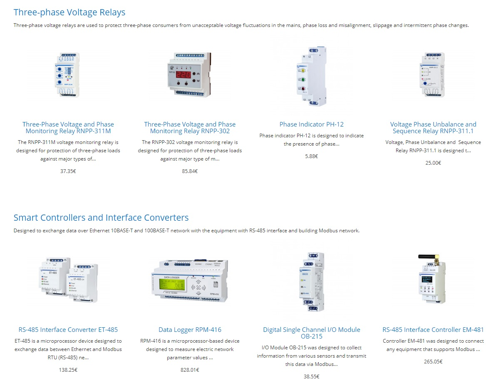

# Catalog display plugin for OpenCart

[View on OpenCart marketplace](https://www.opencart.com/index.php?route=marketplace/extension/info&extension_id=37990)

## Compatibility

* OpenCart: 3.0.3.2, 3.0.3.3, 3.0.3.4
* PHP: >=7.0

If you succeed to use this plugin on another versions of OpenCart or PHP let me know.

## Description

This plugin provides a module that displays a catalog of products by categories. The order of displaying categories can be changed in the admin panel. Categories include:

* The name of the category, with a link to other products from this category.

* Category description.

* List of products. Output order can be configured in the admin panel.

**Important!** If a product is assigned to several categories, it may be displayed several times.



## Installation and configuration

1. Download Catalog display plugin [zip](./Catalog-display.ocmod.zip).

2. Connect to OpenCart admin panel.

3. Upload the plugin:

    ```
    Extensions -> Extensions Installer -> Upload
    ```

4. Install the plugin:

    ```
    Extensions -> Extensions -> Modules -> Catalog display -> Install
    ```

5. Reload plugins cache (blue button in the upper right corner):

    ```
    Extensions -> Modifications
    ```

6. Find the layout of the page where you want display the catalog:

    ```
    Design -> Layouts -> *Layout name* -> Edit
    ```

7. Select the plugin in the drop-down list of the section you need.

8. Save changes.

## How to add products to catalog

1. Find the product you want to show in the catalog:

    ```
    Catalog -> Products -> *Product name* -> Edit
    ```
    
2. Go to **Data** section.

3. Switch option **Show in catalog** to **Yes**.

4. Save changes.

## License

[MIT](https://github.com/overvis/opencart-plugins/blob/master/LICENSE)

## Support

If you have any questions you can ask them [here](https://github.com/overvis/opencart-plugins/issues)
