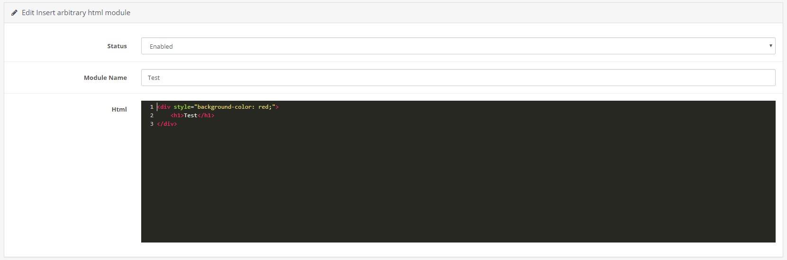

# Insert arbitrary html plugin for OpenCart

[View on OpenCart marketplace](https://www.opencart.com/index.php?route=marketplace/extension/info&extension_id=38006)

## Requirements

* OpenCart: 3.x
* PHP: >=7.0

## Description

This plugin allows to insert an arbitrary HTML code on any page.



## Installation and configuration

### Installation form admin panel

1. Download Insert arbitrary html plugin [zip](./Insert-arbitrary-html.ocmod.zip).

2. Connect to OpenCart admin panel.

3. Upload the plugin:

    ```
    Extensions -> Extensions Installer -> Upload
    ```

4. Install the plugin:

    ```
    Extensions -> Extensions -> Modules -> Insert arbitrary html -> Install
    ```

5. Reload plugins cache (blue button in the upper right corner):

    ```
    Extensions -> Modifications
    ```

### Installation by FTP

1. Download Insert arbitrary html plugin [zip](./Insert-arbitrary-html.ocmod.zip).

2. Connect to server and go to OpenCart root directory.

3. Open upload directory inside downloaded archive.

4. Extract directories to OpenCart root directory.

5. Install the plugin:

    ```
    Extensions -> Extensions -> Modules -> Insert arbitrary html -> Install
    ```

5. Reload plugins cache (blue button in the upper right corner):

    ```
    Extensions -> Modifications
    ```

### Configuration

1. Go to config page:

    ```
    Extensions -> Extensions -> Modules -> Insert arbitrary html -> Add new
    ```

2. Paster your HTML in text area.

3. Save changes.

4. Find the layouts of the pages where you want to paste notice bar:

    ```
    Design -> Layouts -> *Layout name* -> Edit
    ```

5. Select the plugin in the drop-down list of the section you need.

6. Save changes.

## License

[MIT](https://github.com/overvis/opencart-plugins/blob/master/LICENSE)

## Support

If you have any questions you can ask them [here](https://github.com/overvis/opencart-plugins/issues)
