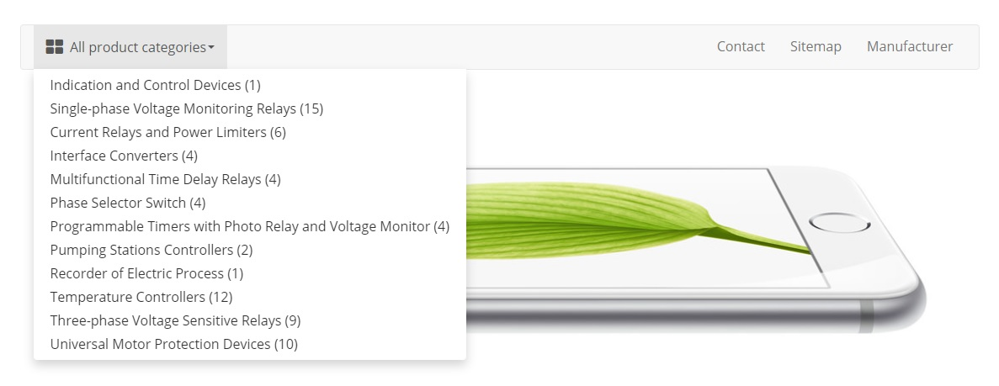

# Simple navigation bar plugin for OpenCart

[View on OpenCart marketplace](https://www.opencart.com/index.php?route=marketplace/extension/info&extension_id=37992)

## Compatibility

* OpenCart: 3.0.3.2, 3.0.3.3, 3.0.3.4, 3.0.3.7
* PHP: >=7.0

If you succeed to use this plugin on another versions of OpenCart or PHP let me know.

## Description

This plugin adds a navigation bar to your OpenCart store. Navigation contains a drop-down list of product categories and some pages (you can select them in the admin panel). Plugin supports a large number of settings for visual customization, so it’s easy to adjust the navigation bar to the color scheme of your site. 

The navigation bar is adaptive and will look good on all devices. In the screenshots below you can see the appearance of the desktop and mobile version of navigation bar.

**Important!** The drop-down list supports only one level of categories.




## Installation and configuration

1. Download Simple navigation bar plugin [zip](./Simple-Navigation-Bar.ocmod.zip).

2. Connect to OpenCart admin panel.

3. Upload the plugin:

    ```
    Extensions -> Extensions Installer -> Upload
    ```

4. Reload plugins cache (Blue button in the upper right corner):

    ```
    Extensions -> Modifications
    ```

5. Install the plugin:

    ```
    Extensions -> Extensions -> Modules -> Simple navigation bar -> Install
    ```

6. Go to config page:

    ```
    Extensions -> Extensions -> Modules -> Simple navigation bar -> Add new
    ```

7. Change the settings as necessary or leave the default ones.

8. Save changes.

9. Find the layout of the page where you want to paste navigation bar:

    ```
    Design -> Layouts -> *Layout name* -> Edit
    ```

10. Select the plugin in the drop-down list at the top of the section you need.

11. Save changes.

## How to select pages to display in the navigation

1. Find a layout, link to which you want to display in the navigation bar:

    ```
    Design -> Layouts -> *Layout name* -> Edit
    ```

2. Switch the option **Show in navbar** to **Yes**.

3. Save changes.

## How to remove navigation bar from default template

1. Connect to OpenCart admin panel.

2. Go to theme editor:

    ```
    Design -> Theme Editor
    ```
   
3. Choose needed template: `common/header.twig`

4. On 81 line replace `{{ menu }}` with `{#{{ menu }}#}`

5. Save changes.

If you know a better way to do this, let me know.

## License

[MIT](https://github.com/overvis/opencart-plugins/blob/master/LICENSE)

## Support

If you have any questions you can ask them [here](https://github.com/overvis/opencart-plugins/issues)
